# neTiPx

  🌍 Language:
  - [English](README.md)
  - [Deutsch](README.de.md)

  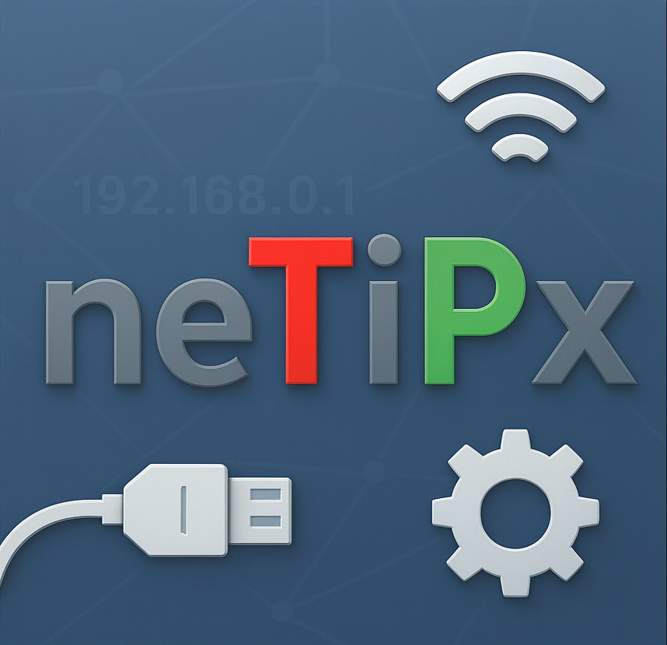

**neTiPx** ist ein modernes Desktop-Tool für Windows zur komfortablen Verwaltung von Netzwerkadaptern und IP-Konfigurationen. Mit einer intuitiven Benutzeroberfläche bietet neTiPx schnellen Zugriff auf alle wichtigen Netzwerkeinstellungen und -informationen.

---

## 📋 Inhaltsverzeichnis

- [Features](#-features)
- [Screenshots](#-screenshots)
  - [Adapter-Übersicht](#adapter-übersicht)
  - [IP-Konfiguration](#ip-konfiguration)
  - [Ping Tool](#ping-tool)
  - [WLAN Scanner](#wlan-scanner)
  - [Netzwerk-Rechner](#netzwerk-rechner)
  - [Netzwerkscanner](#netzwerkscanner)
  - [Log Viewer](#log-viewer)
  - [Routen Tool](#routen-tool)
  - [Info](#info)
  - [Einstellungen](#einstellungen)
- [Funktionen im Detail](#-funktionen-im-detail)
  - [PING Tool](#ping-tool-1)
  - [Ping-Logging](#ping-logging)
  - [Log Viewer](#log-viewer-1)
  - [WLAN Scanner - Technische Details](#wlan-scanner---technische-details)
  - [Netzwerkscanner - Technische Details](#netzwerkscanner---technische-details)
  - [Routenverwaltung und Routing-Analyse](#routenverwaltung-und-routing-analyse)
- [Systemanforderungen](#-systemanforderungen)
- [Installation](#-installation)

---

## ✨ Features

- 🔌 **Adapter-Verwaltung**: Übersicht über bis zu zwei Netzwerkadapter mit detaillierten Informationen
- 🌐 **IP-Profilmanager**: Verwaltung mehrerer IP-Profile für schnelles Umschalten zwischen Netzwerkkonfigurationen
- 📊 **Netzwerk-Informationen**: Detaillierte Anzeige von IPv4/IPv6-Adressen, Gateway, DNS und MAC-Adressen
- 🎯 **Verbindungsstatus**: Echtzeit-Ping-Überwachung von Gateway und DNS-Servern mit visueller Ampel
- 🎨 **Theme-Support**: Anpassbare Farbthemen (Hell/Dunkel/System) mit mehreren vordefinierten Farbschemata
- 📍 **System Tray Integration**: Minimierung in die Taskleiste mit Hover-Fenster für schnelle Netzwerk-Infos
- 🚀 **Autostart**: Optional beim Systemstart starten
- 🛰️ **PING Tool**: Mehrere Ziele parallel überwachen (IPv4/IPv6), pro Ziel aktivierbar/deaktivierbar
- 📝 **Ping-Logging**: Automatische Log-Dateien pro Ziel inklusive Öffnen, Exportieren und Löschen
- 🧭 **Hintergrundbetrieb**: Pings laufen optional weiter, wenn die Ping-Seite nicht aktiv ist
- 📡 **WLAN Scanner**: Native Windows API für detaillierte WLAN-Netzwerk-Informationen
- 🧮 **Netzwerk-Rechner**: IP-Subnetz-Berechnungen mit intelligenter Bereichserkennung und bidirektionaler Synchronisierung
- 🔎 **Netzwerkscanner**: Scan von IP-Bereichen mit Port-Prüfung und Detailansicht gefundener Geräte
- 📄 **Log Viewer**: Öffnen und Live-Anzeigen von Logdateien mit Filter, Highlight-Regeln, 16-Farben-Swatch-Auswahl und optionalem Auto-Scroll
- 🛣️ **Routen Tool**: Anzeige aktueller IPv4-Routen inkl. Löschfunktion für benutzerseitige/persistente Routen und direktem Hinzufügen neuer Routen
- 🧩 **Modulare Tools-Seite**: Ping, WLAN, Netzwerk-Rechner, Netzwerkscanner, Log Viewer und Routen als eigene Unterseiten mit Lazy-Loading
- 🗂️ **Seiten-Sichtbarkeit**: Haupt- und Toolseiten können über `PagesVisibility.xml` ein-/ausgeblendet werden
- 🛠️ **Versteckte Admin-Konfiguration**: Auf der Settings-Seite öffnet das Wort `Wünschen` einen Dialog zur Pflege der Seiten-Sichtbarkeit

zurück zum
[Inhaltsverzeichnis](#-inhaltsverzeichnis)
---

## 📸 Screenshots

### Adapter-Übersicht

Die Adapter-Seite zeigt detaillierte Informationen zu Ihren konfigurierten Netzwerkadaptern:

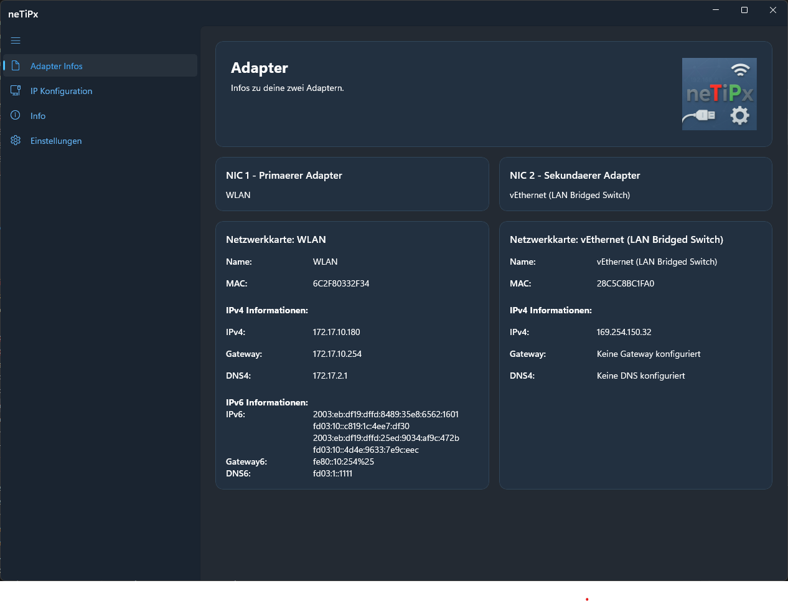

**Angezegte Informationen:**
- Name und MAC-Adresse des Adapters
- IPv4-Adressen mit Subnetzmasken
- IPv6-Adressen
- Gateway-Adressen (IPv4 und IPv6)
- DNS-Server (IPv4 und IPv6)
- Übersichtliche Darstellung für bis zu zwei Adapter gleichzeitig

### IP-Konfiguration

Verwalten Sie mehrere IP-Profile und wechseln Sie schnell zwischen verschiedenen Netzwerkkonfigurationen:

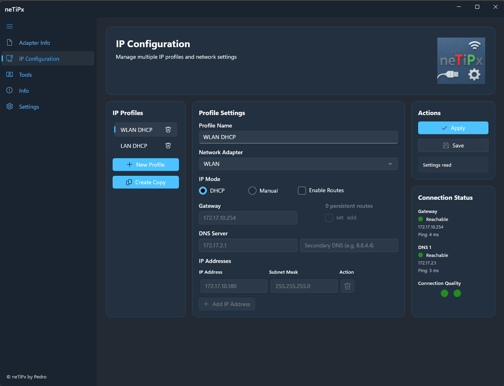

**Funktionen:**
- **Profilmanager**: Erstellen, bearbeiten und löschen Sie IP-Profile
- **DHCP oder Manuell**: Wählen Sie zwischen automatischer und manueller IP-Konfiguration
- **Multiple IP-Adressen**: Weisen Sie einem Adapter mehrere IP-Adressen zu
- **DNS-Konfiguration**: Konfigurieren Sie primäre und sekundäre DNS-Server
- **Routen pro Profil**: Verwalten Sie statische IPv4-Routen direkt im IP-Profil
- **Routenmodus**: Wählen Sie pro Profil zwischen `ersetzen` und `hinzufügen` vorhandener persistenter Routen
- **Systemabgleich**: Bereits vorhandene Systemrouten werden beim Profil-Dialog erkannt und markiert
- **Echtzeit-Verbindungsstatus**: Überwachen Sie Gateway und DNS-Server mit farbcodierter Ampel
  - 🟢 Grün: Erreichbar (guter Ping)
  - 🟡 Gelb: Erreichbar (langsamer Ping)
  - 🔴 Rot: Nicht erreichbar
- **Ping-Anzeige**: Zeigt aktuelle Ping-Zeiten für Gateway und DNS-Server

### Ping Tool

Das Ping Tool ermöglicht die Überwachung mehrerer Ziele mit eigener Taktung und Protokollanzeige:

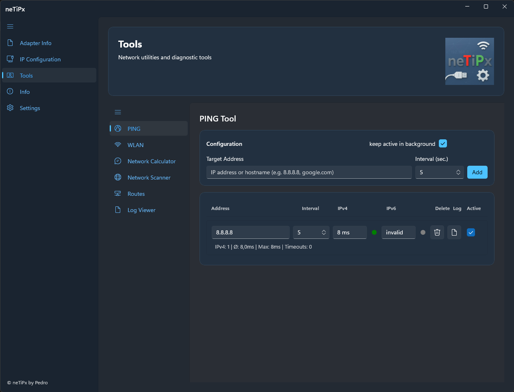

**Funktionen:**
- **Mehrere Ziele**: IPs oder Hostnamen hinzufügen und parallel überwachen
- **Intervall pro Ziel**: Eigene Ping-Frequenz je Eintrag
- **IPv4/IPv6 Anzeige**: Antwortzeit und Status-Ampel pro Protokoll
- **Aktiv-Status pro Zeile**: Einzelne Ziele unabhängig ein- und ausschalten
- **Hintergrund-Option**: Pings laufen optional weiter, auch wenn die Ping-Seite nicht im Fokus ist
- **Status für nicht genutzte Protokolle**: Anzeige `inaktiv` mit grauer Ampel

### WLAN Scanner

Der WLAN Scanner nutzt die native Windows WLAN API für detaillierte Netzwerkinformationen:

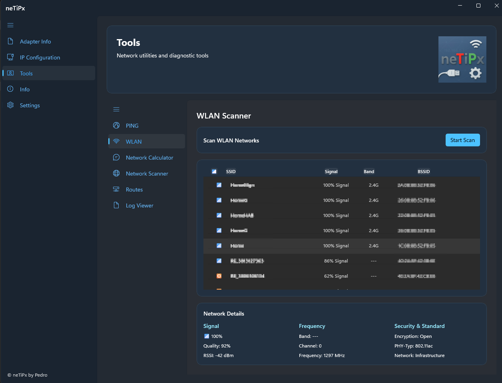

**Funktionen:**
- **Native API**: Direkter Zugriff auf Windows WLAN-Schnittstelle
- **Sortierbare Tabelle**: Klicken Sie auf Spaltenüberschriften zum Sortieren
  - 📶 Signal-Symbol (Stärke-Visualisierung)
  - SSID (Netzwerkname)
  - Signal (Prozent)
  - BSSID (MAC-Adresse des Access Points)
- **Detaillierte Informationen** in drei Bereichen:
  - **Signal**: Stärke (%), Qualität (%), RSSI (dBm)
  - **Frequenz**: Band (2.4G/5G/6G), Kanal, Frequenz (MHz)
  - **Sicherheit & Standard**: Verschlüsselung (🔓 gesichert / 🔒 offen), PHY-Typ (802.11a/b/g/n/ac/ax), Netzwerk-Typ
- **Band-Erkennung**: Automatische Erkennung von 2.4 GHz, 5 GHz und 6 GHz (Wi-Fi 6E)
- **Signal-Symbole**:
  - 📶 Stark (≥75%)
  - 📳 Mittel (50-74%)
  - 📴 Schwach (25-49%)
  - ❌ Sehr schwach (<25%)

### Netzwerk-Rechner

Der Netzwerk-Rechner bietet intelligente IP-Subnetz-Berechnungen mit automatischer Synchronisierung:

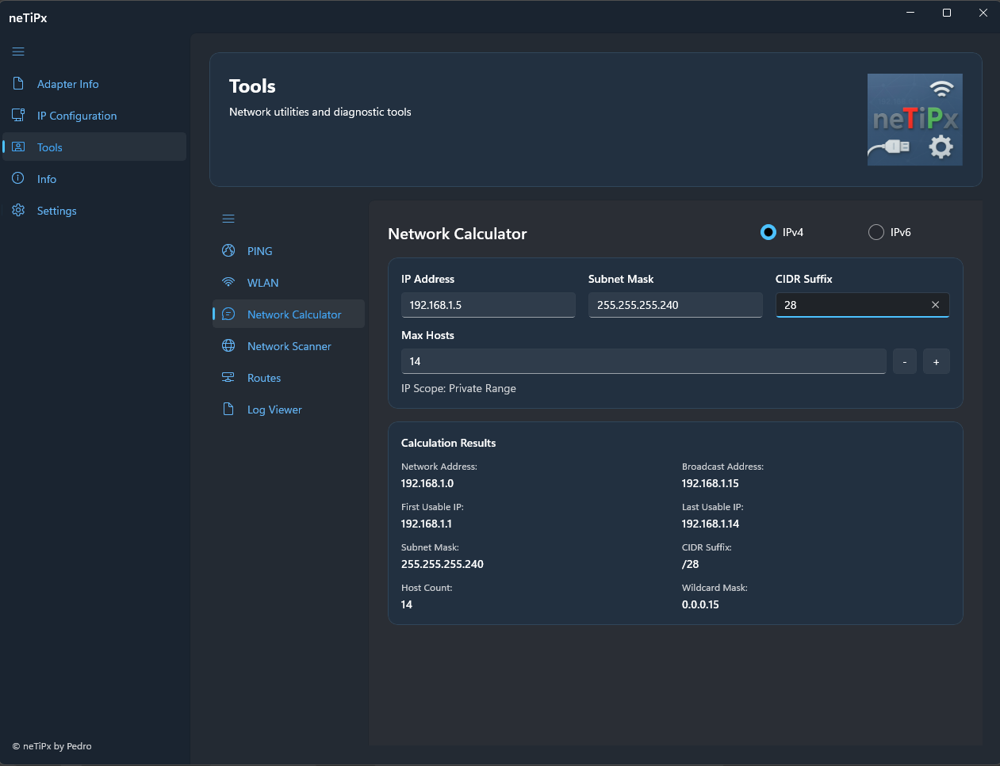

**Funktionen:**
- **Intelligente Eingabe**: IP-Adresse, Subnetzmaske oder CIDR-Sufix - alle Felder aktualisieren sich automatisch
- **Bidirektionale Synchronisierung**:
  - Änderung der Subnetzmaske → automatische Berechnung von CIDR-Sufix und Max. Hosts
  - Änderung des CIDR-Sufix → automatische Berechnung von Subnetzmaske und Max. Hosts
  - Änderung von Max. Hosts → automatische Berechnung von Subnetzmaske und CIDR-Sufix
- **Plus/Minus-Steuerung**: Schnelles Umschalten zwischen gültigen Host-Anzahlen (z.B. 254 → 510 → 1022)
- **Automatische Berechnung**: Ergebnisse werden sofort bei gültigen Eingaben angezeigt
- **IP-Bereichserkennung**: Automatische Klassifizierung der eingegebenen IP:
  - Privater Bereich (10.x.x.x, 172.16-31.x.x, 192.168.x.x)
  - Public Bereich
  - Loopback (127.x.x.x)
  - Zeroconf/Link-Local (169.254.x.x)
  - Multicast (224.x.x.x - 239.x.x.x)
  - Shared Address Space/CGNAT (100.64.x.x)
  - Dokumentationsbereich
  - Broadcast, Unspecified, Reserviert
- **Detaillierte Ergebnisse**:
  - Netzwerkadresse und Broadcast-Adresse
  - Erste und letzte verwendbare IP
  - Subnetzmaske und CIDR-Sufix
  - Anzahl verfügbarer Hosts
  - Wildcard-Maske

### Netzwerkscanner

Der Netzwerkscanner durchsucht lokale IP-Bereiche und zeigt erkannte Geräte inkl. Port-Status an.

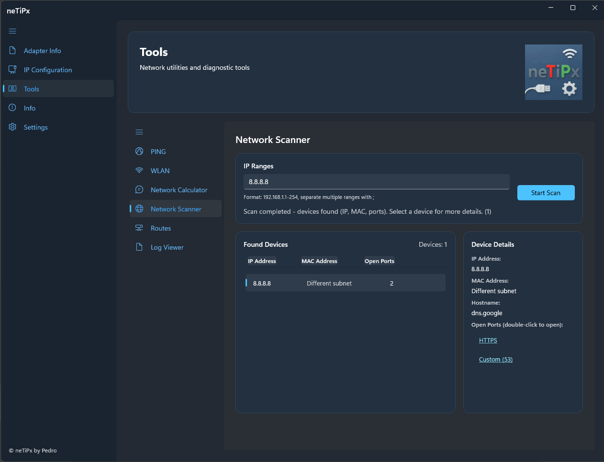

**Funktionen:**
- **Scan von IP-Bereichen**: Einzelne Bereiche oder mehrere Bereiche in einer Anfrage
- **Port-Prüfung**: Frei konfigurierbare Portliste für Erreichbarkeits- und Dienstprüfung
- **Geräteliste mit Details**: Übersicht erkannter Hosts mit Detailbereich zur schnellen Auswertung
- **Direktaktionen**: Offene Ports können per Doppelklick mit der Standardanwendung geöffnet werden

### Log Viewer

Der Log Viewer öffnet vorhandene Logdateien und zeigt neue Einträge live in einer separaten Tool-Unterseite an.

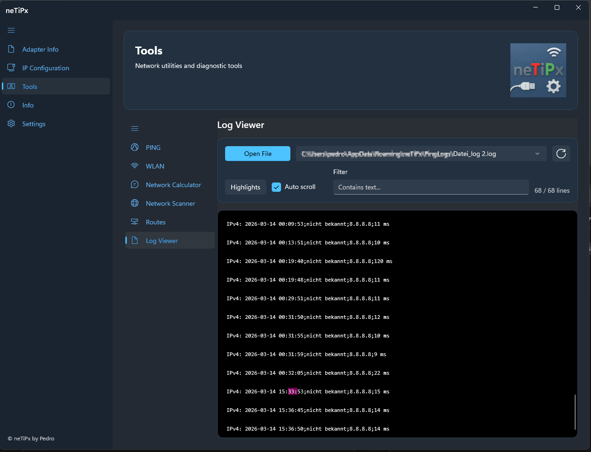

**Funktionen:**
- **Dateiauswahl und Verlauf**: Zuletzt verwendete Logdateien lassen sich direkt erneut öffnen
- **Live-Anzeige**: Neue Einträge werden automatisch an die bestehende Ansicht angehängt
- **Filter und Suche**: Freitextfilter mit Trefferzähler (`sichtbar / gesamt`) und sofortiger Aktualisierung
- **Highlight-Regeln**: Suchbegriffe können farblich markiert werden
- **Farbwahl über Swatches**: Auswahl über farbige Rechteck-Swatches statt Textliste
- **Erweiterte Farbpalette**: 16 auswählbare Farben für Hervorhebungen
- **Automatisches Weiterscrollen**: Optionales Mitscrollen ans Dateiende während neue Einträge eintreffen
- **Robustes Nachladen**: Auch während die Datei von einem anderen Prozess beschrieben wird, bleibt die Anzeige lesbar

### Routen Tool

Das Routen Tool zeigt die aktuelle IPv4-Routing-Tabelle und unterstützt die gezielte Analyse für ein konkretes Ziel.

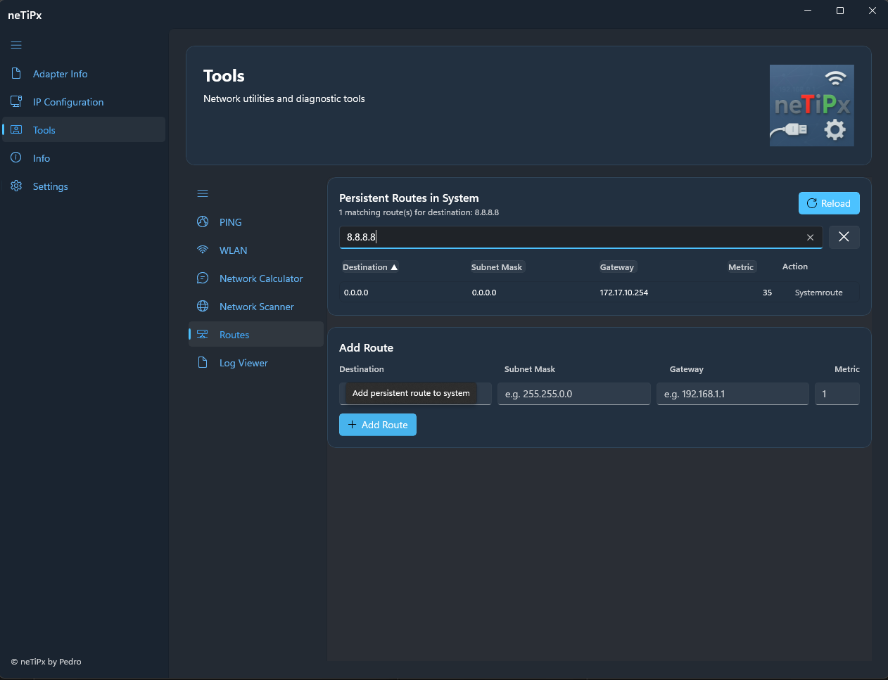

### Info

Die Info-Seite bündelt Versions- und Update-Informationen sowie wichtige Links.

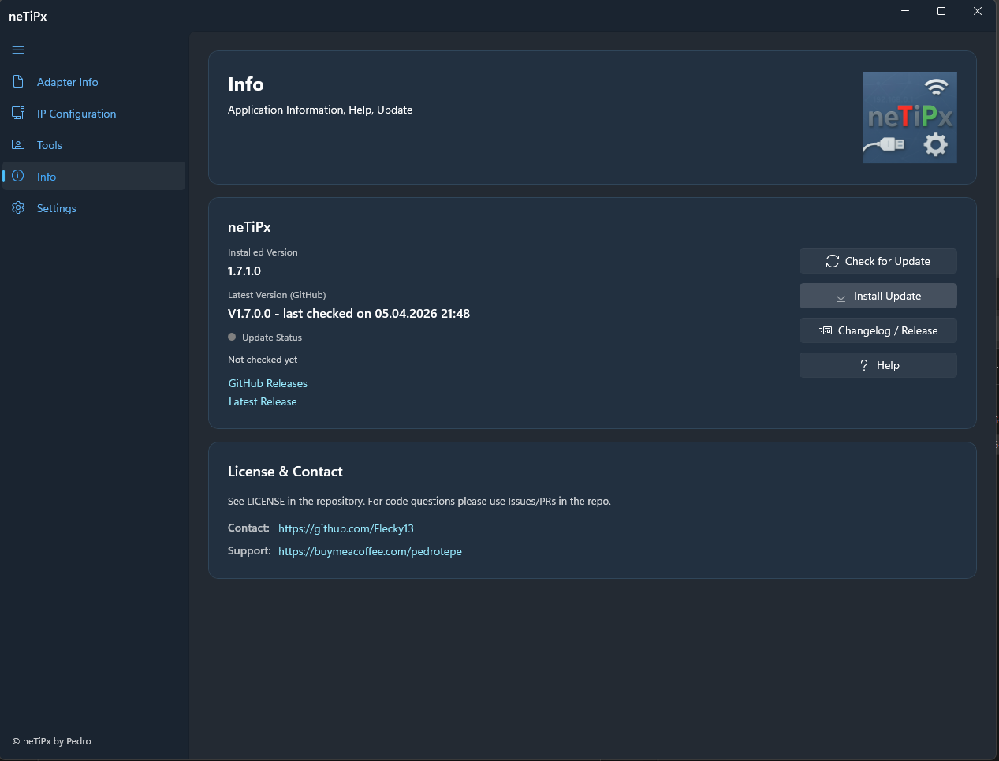

**Funktionen:**
- **Routenübersicht**: Anzeige aktueller und persistenter IPv4-Routen inklusive Default-Route (`0.0.0.0/0`)
- **Löschlogik nach Quelle**: Löschbutton nur für benutzerseitige/statische Routen, Systemrouten werden als `Systemroute` gekennzeichnet
- **Ziel-IP-Filter**: Eingabe einer Ziel-IP zeigt nur die tatsächlich relevanten Routen (Longest Prefix Match + Metrik)
- **Sortierbare Tabelle**: Sortierung über Spaltenköpfe mit Richtungsanzeige (`▲`/`▼`)
- **Route hinzufügen**: Persistente Route direkt aus dem Tool anlegen

### Einstellungen

Konfigurieren Sie die Anwendung nach Ihren Bedürfnissen:

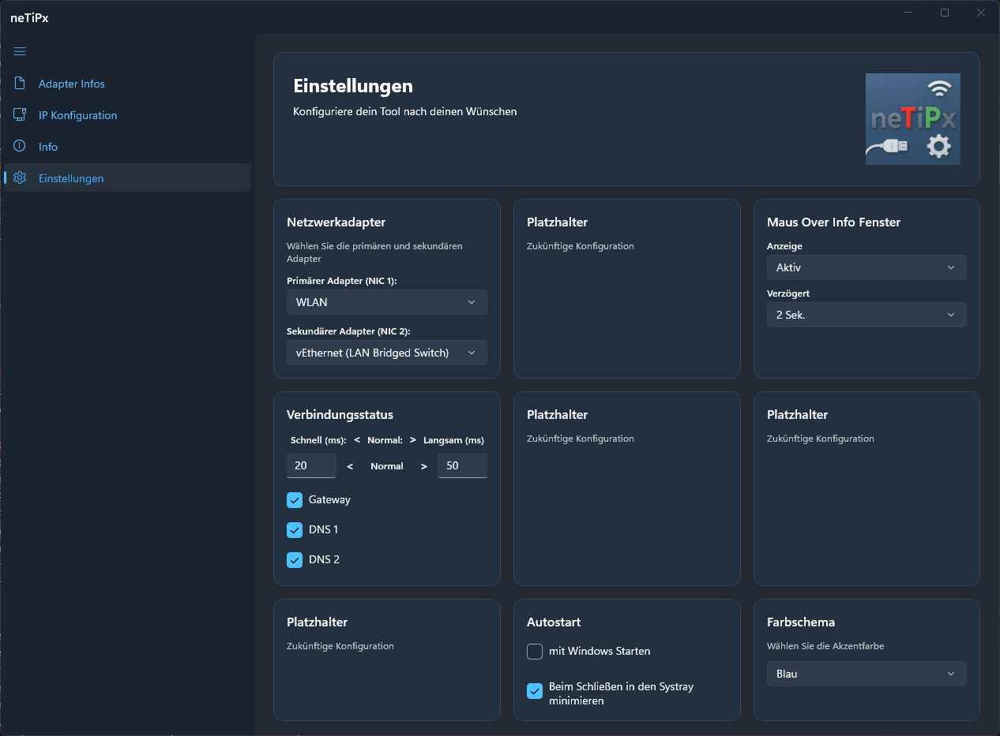

**Einstellungsmöglichkeiten:**

#### 📡 Netzwerkadapter
- **Adapter 1 & 2**: Wählen Sie die zwei Hauptadapter aus, die auf der Adapter-Seite angezeigt werden
- Nur aktive Netzwerkadapter werden zur Auswahl angezeigt

#### 🔔 System Tray
- **Hover-Fenster**: Zeigt Netzwerkinformationen beim Überfahren des Tray-Icons
- **Minimierung**: Option zum Minimieren in die Taskleiste statt Schließen

#### 🚀 Autostart
- **Bei Windows-Start**: Startet die Anwendung automatisch beim Systemstart
- **Minimiert starten**: Startet die Anwendung minimiert im System Tray

#### 📝 Ping-Logging
- **Log-Ordner wählen**: Eigener Speicherort für Ping-Logs auswählbar
- **Standard-Ordner**: Schnell auf den Standardpfad zurücksetzen
- **Pfadanzeige**: Dynamisch angepasste Ein-Zeilen-Anzeige mit Tooltip für den vollständigen Pfad

#### 🗂️ Seiten-Sichtbarkeit
- **Konfigurationsdatei**: `%APPDATA%\\neTiPx\\PagesVisibility.xml`
- **Versteckter Dialog**: In den Einstellungen auf das Wort `Wünschen` klicken
- **Gruppierte Steuerung**: Separate Bereiche für `Hauptseiten` und `Tools`
- **Abhängigkeit Tools**:
  - `Tools (Hauptseite)` aus => alle Tool-Unterseiten aus
  - Eine Tool-Unterseite an => `Tools (Hauptseite)` automatisch an
  - Alle Tool-Unterseiten aus => `Tools (Hauptseite)` automatisch aus
- **Immer sichtbar**: `Adapter Infos`, `Info` und `Einstellungen` sind fest sichtbar und nicht per XML ausblendbar
- **Live-Aktualisierung**: Beim Schließen des Dialogs werden XML-Werte gespeichert und die Navigation sofort aktualisiert

#### 🎨 Farbthemen
- **Theme-Auswahl**: Wählen Sie aus mehreren vordefinierten Farbthemen
  - Hell/Dunkel/System
  - Rot, Blau, Grün, Orange, Lila, Türkis
- **Benutzerdefinierte Themes**: Erstellen und bearbeiten Sie eigene Farbthemen
- **Theme-Editor**: Passen Sie Hintergrund-, Text- und Akzentfarben individuell an

#### 🌐 Sprachauswahl

- Die Anwendung unterstützt mehrere Sprachen. Über das Dropdown-Menü in den Einstellungen kann die Anzeigesprache gewählt werden.
- Im Dropdown werden die Eigenbezeichnungen der Sprachen (z. B. „Deutsch", „English", „Español") angezeigt. Diese werden dynamisch aus den Sprachdateien geladen.
- Änderungen der Sprache wirken sich sofort auf die gesamte Benutzeroberfläche aus.

zurück zum
[Inhaltsverzeichnis](#-inhaltsverzeichnis)
---

## 🔧 Funktionen im Detail

### PING Tool

- **Paralleles Monitoring**: Mehrere Ziele werden gleichzeitig überwacht
- **Zieltypen**: Unterstützt IPv4, IPv6 und Hostnamen
- **Sichtbares Protokollverhalten**:
  - Nicht verwendetes Protokoll zeigt `inaktiv` und eine graue Ampel
  - Deaktiviertes Ziel zeigt `Deaktiviert` für beide Protokolle
- **Flexible Aktivierung**:
  - Pro Ziel über die Zeilen-Checkbox
  - Global für Hintergrundbetrieb über `im Hintergrund weiter aktiv`

### Ping-Logging

- **Pro Ziel eigene Log-Datei**: Eindeutige Dateinamen, auch bei Sonderzeichen im Zielnamen
- **CSV-Format mit Zeitstempel**: `Zeit;Ziel;Protokoll;Antwortzeit`
- **Direkte Aktionen in der Liste**:
  - Log-Datei öffnen
  - Beim Löschen wahlweise mitlöschen
  - Vor dem Löschen optional per `Speichern unter` exportieren
- **Protokollspezifisches Logging**: Nur relevante IPv4/IPv6-Einträge werden geschrieben

### Log Viewer

- **Unterstützte Formate**: Öffnet Log-, Text-, CSV- und JSON-Dateien zur schnellen Sichtprüfung
- **Live-Append statt Voll-Reload**: Neue Daten werden an die bestehende Anzeige angehängt, ohne die ganze Datei jedes Mal neu aufzubauen
- **Highlight-Regeln mit Farbswatches**: Regeln können angelegt, entfernt, importiert und exportiert werden; Farbauswahl über visuelle Swatches
- **16 Highlight-Farben**: Erweiterte Palette für bessere visuelle Unterscheidung im Log
- **Filter mit Trefferzähler**: Textsuche mit Hervorhebung und Anzeige `sichtbar / gesamt`
- **Auto-Scroll optional**: Bei aktivierter Option bleibt die Ansicht am Ende der Datei; deaktiviert bleibt die aktuelle Position erhalten
- **Vollständige Lokalisierung**: Alle sichtbaren Texte des Log-Viewers inklusive Highlight-Dialog kommen aus den Sprachdateien
- **Fehlertolerantes Lesen**: Datei wird mit gemeinsamem Zugriff geöffnet, damit auch aktiv beschriebene Logs beobachtet werden können

### WLAN Scanner - Technische Details

- **Native Windows WLAN API**: Direkter P/Invoke-Zugriff auf wlanapi.dll
  - WlanOpenHandle: Initialisierung der WLAN-Schnittstelle
  - WlanEnumInterfaces: Auflistung verfügbarer WLAN-Adapter
  - WlanGetNetworkBssList: Abruf detaillierter BSS-Informationen
- **Thread-sichere UI-Updates**: DispatcherQueue für sichere Updates aus Background-Threads
- **Umfassende Netzwerkinformationen**:
  - Signal: dBm, Prozent, Link-Qualität
  - Frequenz: MHz, Kanal, Band (2.4/5/6 GHz)
  - Sicherheit: Privacy Bit, Verschlüsselungsstatus
  - Standard: PHY-Typ (802.11-Varianten), Netzwerk-Typ (Infrastructure/Ad-Hoc)
  - Hardware: BSSID, Beacon-Intervall
- **Robustheit**: Automatischer Fallback auf netsh-Kommandozeile bei API-Problemen

### Netzwerkscanner - Technische Details

- **Asynchrones Scannen**: Nicht-blockierende Host- und Port-Prüfungen für flüssige Bedienung
- **Abbruchfähig**: Laufende Scans können kontrolliert gestoppt werden
- **Sortierbare Ergebnisliste**: Geräte können nach relevanten Spalten geordnet werden
- **Detailansicht je Gerät**: Zusammengefasste Host-Informationen und erkannte offene Ports

### Routenverwaltung und Routing-Analyse

- **Quellenbasierte Klassifizierung**: Kombination aus `route print`, CIM (`Win32_IP4PersistedRouteTable`) und `Get-NetRoute` zur Unterscheidung von System- und Benutzer-Routen
- **Persistenz-Erkennung**: Statische/persistente Routen werden als löschbar erkannt, systemseitige On-link/Local/DHCP-Routen bleiben geschützt
- **Routing-Entscheidung im Filter**: Für Ziel-IPs werden nur Kandidaten mit bestem Präfix und bester Metrik angezeigt
- **Sichere Lösch-/Add-Operationen**: Route-Änderungen erfolgen erhöht und werden nach Aktion in der Tabelle neu eingelesen

### IP-Profilverwaltung

- **Mehrere Profile**: Speichern Sie unterschiedliche Netzwerkkonfigurationen für verschiedene Standorte (Büro, Home Office, Extern)
- **Schnelles Umschalten**: Wechseln Sie mit wenigen Klicks zwischen gespeicherten Profilen
- **DHCP-Unterstützung**: Automatische IP-Konfiguration via DHCP
- **Manuelle Konfiguration**: Detaillierte Kontrolle über IP-Adressen, Subnetzmasken, Gateway und DNS
- **Integrierte Routenverwaltung**: Profilbezogene statische IPv4-Routen mit Dialog zur Pflege und Systemabgleich
- **Validierung**: Automatische Überprüfung der eingegebenen IP-Adressen und Netzwerkkonfiguration
- **Multi-IP**: Weisen Sie einem Adapter mehrere IP-Adressen gleichzeitig zu

### Verbindungsqualität

- **Automatische Überwachung**: Kontinuierliches Pingen von Gateway und DNS-Servern (alle 5 Sekunden)
- **Visuelle Anzeige**: Farbcodierte Ampel zeigt den Status auf einen Blick
- **Ping-Zeiten**: Detaillierte Anzeige der Antwortzeiten in Millisekunden
- **Mehrfach-Überwachung**: Gleichzeitige Überwachung von Gateway, DNS1 und DNS2

### Theme-System

- **Anpassbare Oberfläche**: Passen Sie das Aussehen der Anwendung an Ihre Vorlieben an
- **Vordefinierte Themes**: Mehrere professionelle Farbschemata zur Auswahl
- **Echtzeit-Vorschau**: Sehen Sie Änderungen sofort in der Anwendung

zurück zum
[Inhaltsverzeichnis](#-inhaltsverzeichnis)
---

## 💻 Systemanforderungen

- **Betriebssystem**: Windows 10 Version 1809 (Build 17763) oder höher
- **Framework**: .NET 8.0 Runtime
- **UI-Framework**: WinUI 3 (Windows App SDK) - **erforderlich**
- **Berechtigungen**: Administrator-Rechte für Änderungen an Netzwerkeinstellungen

### Windows App SDK

neTiPx erfordert das **Windows App SDK 1.8.5** zur Ausführung. Wenn Sie den folgenden Fehler erhalten:

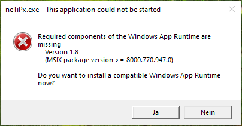

Laden Sie das Windows App SDK herunter und installieren Sie es von:
[Microsoft Windows App SDK Downloads](https://docs.microsoft.com/windows/apps/windows-app-sdk/downloads)

---

## 📦 Installation

### Installation

1. **Systemanforderungen prüfen**: Stellen Sie sicher, dass das Windows App SDK installiert ist (siehe [Systemanforderungen](#-systemanforderungen))
2. Laden Sie das neueste Setup-Paket aus dem [Releases](../../releases)-Bereich herunter
3. Führen Sie `neTiPx_Setup_Vx.x.x.x.exe` aus
4. Folgen Sie den Anweisungen des Installationsassistenten
5. Starten Sie neTiPx über das Startmenü oder Desktop-Icon

**Hinweise**:
- Für Änderungen an Netzwerkeinstellungen sind Administrator-Rechte erforderlich.
- Wenn beim Start eine Fehlermeldung bezüglich des Windows App SDK angezeigt wird, siehe [Systemanforderungen](#windows-app-sdk).

zurück zum
[Inhaltsverzeichnis](#-inhaltsverzeichnis)
---

## 📄 Lizenz & Kontakt

Siehe `LICENSE` im Repository. Für Fragen zum Code bitte Issues/PRs im Repo verwenden.

https://buymeacoffee.com/pedrotepe

zurück zum
[Inhaltsverzeichnis](#-inhaltsverzeichnis)
