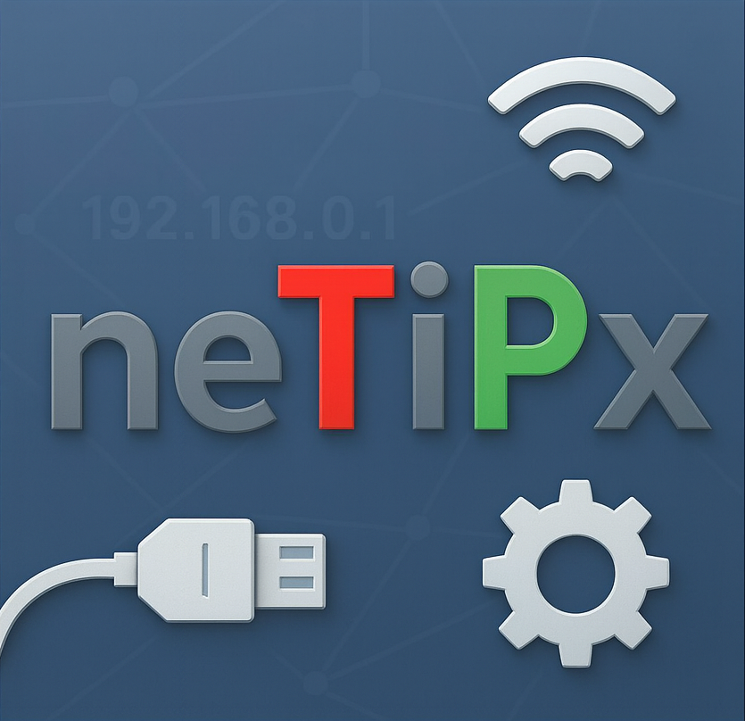
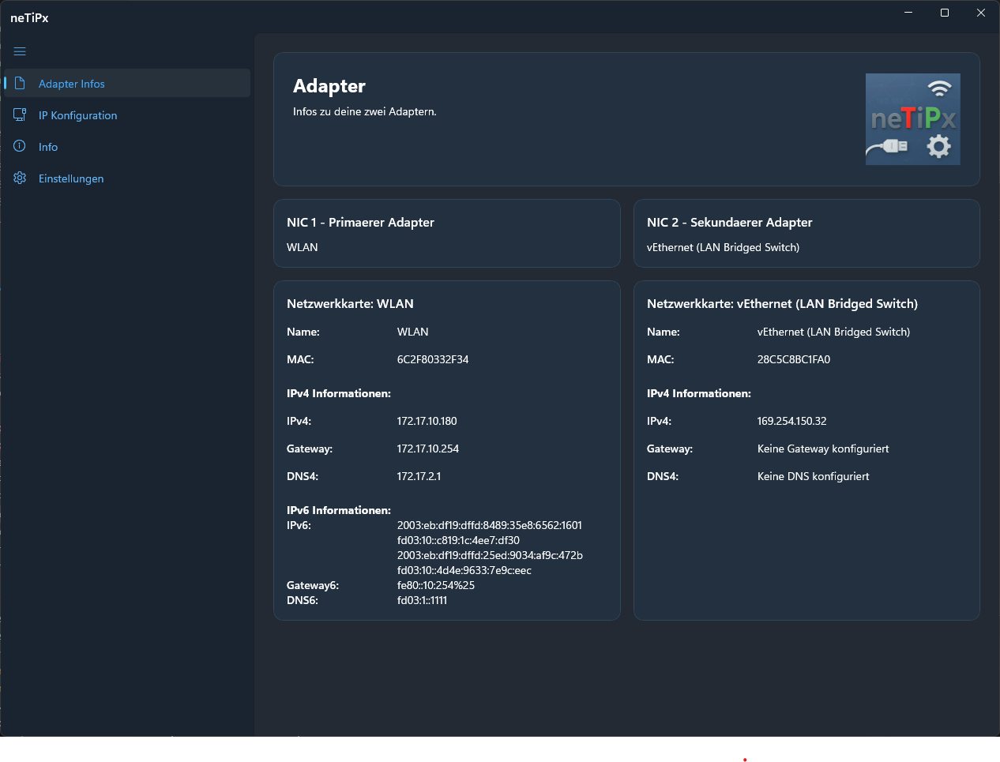
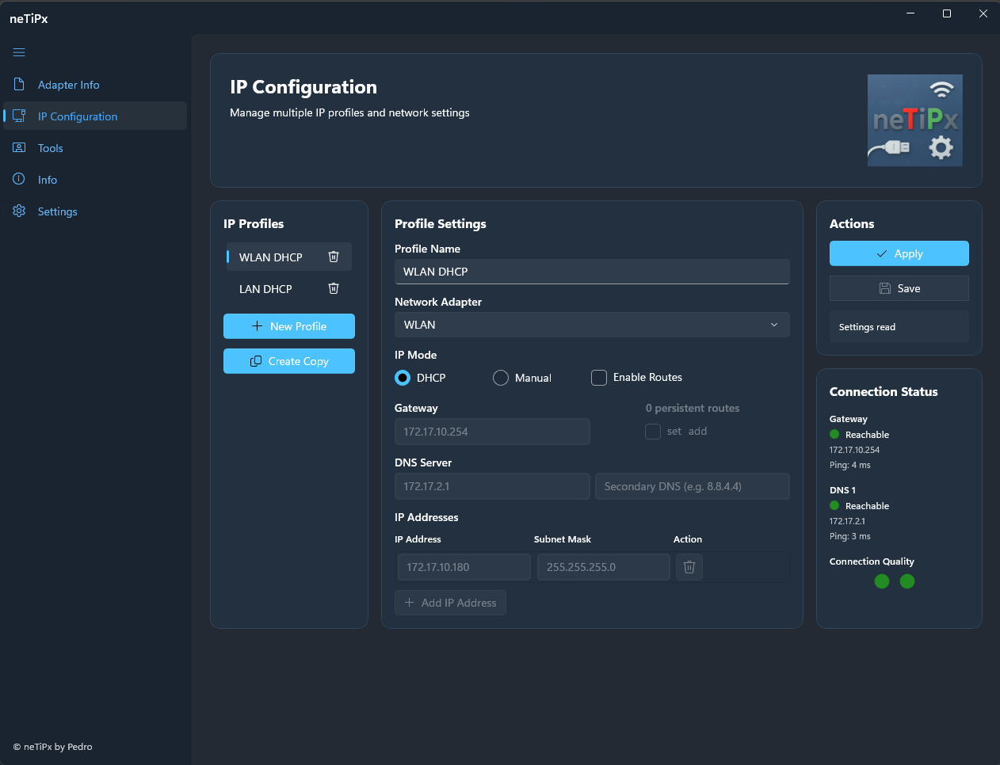
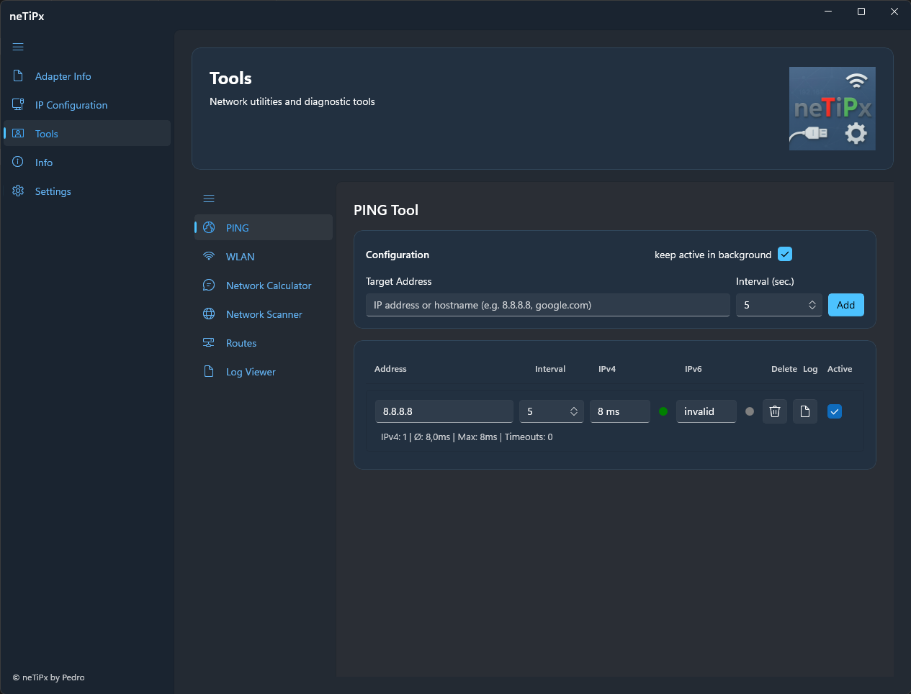
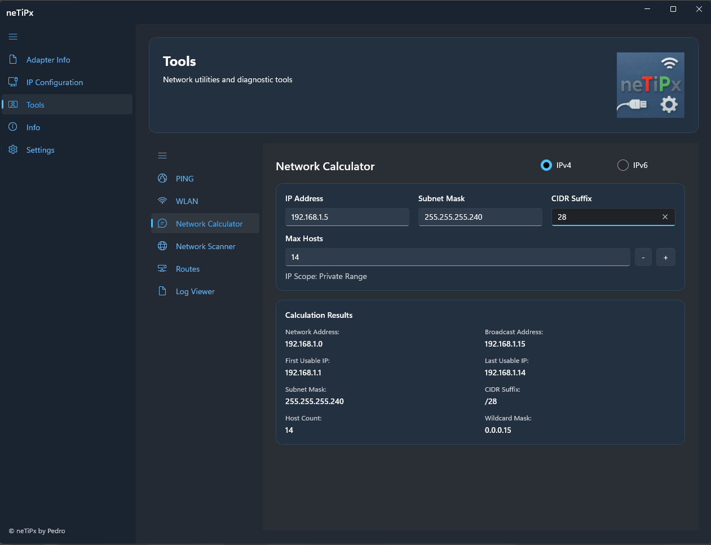
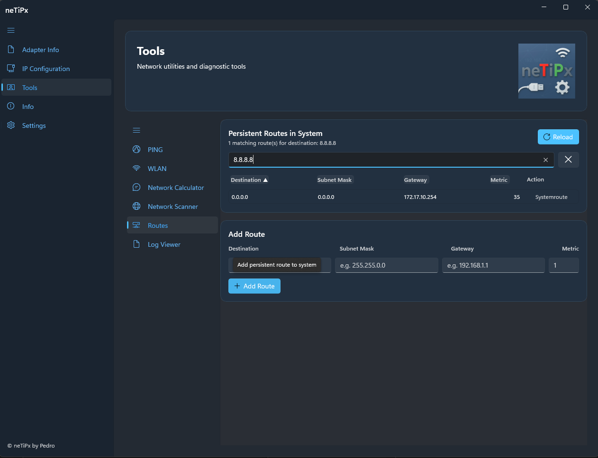
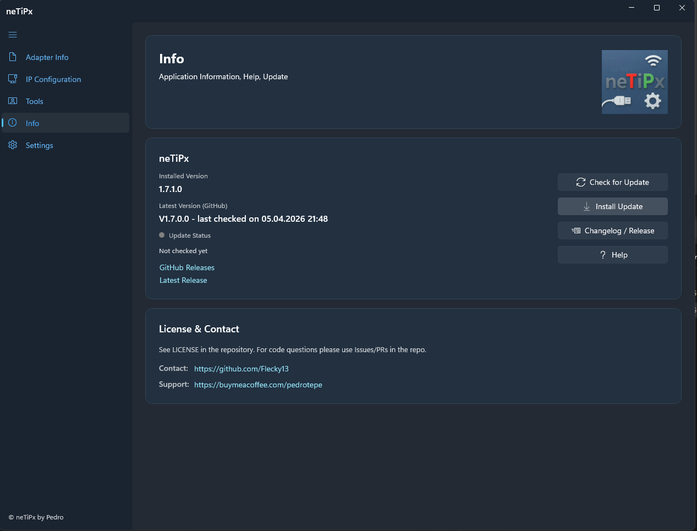
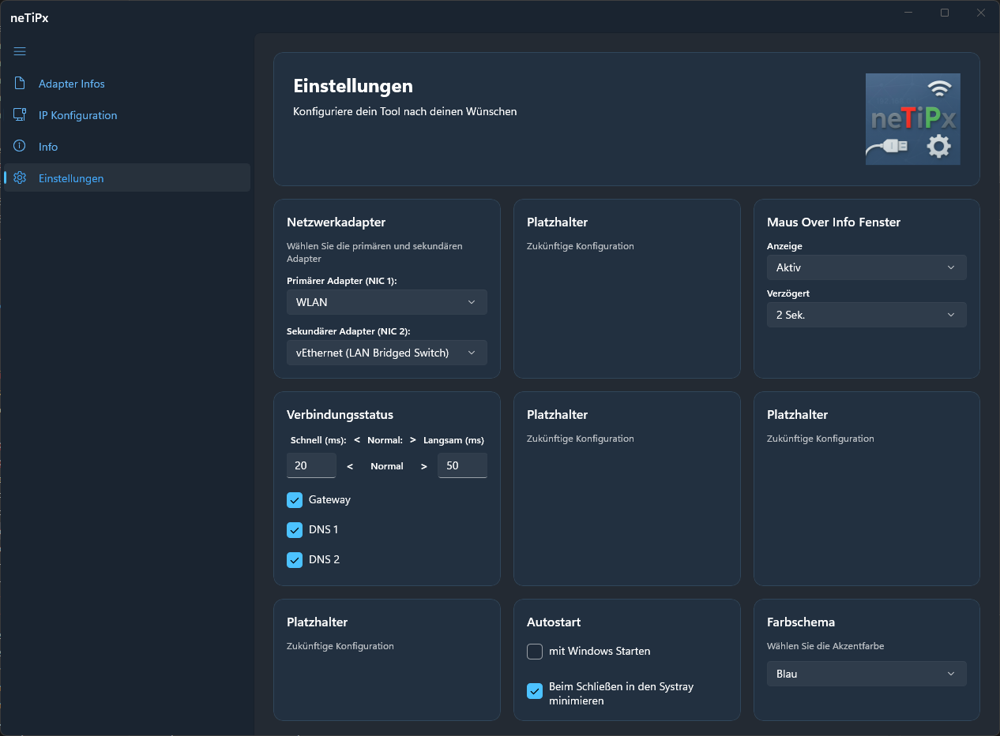

# neTiPx

🌍 Language: English

Hierlang für [Deutsch](README.de.md)

<p align="center">
  
</p>

**neTiPx** is a modern desktop tool for Windows, Linux and macOS for comfortable management of network adapters and IP configurations. With an intuitive user interface, neTiPx provides quick access to all important network settings and information.

> Note: The last pure Windows-only release is version 1.7.2.0.
>
> The first multi-platform release is version 2.0.4.7.
>
> Current test status:

> - Linux: tested
> - Windows: tested
> - macOS: should work, currently untested
>
> If an update from version 1.7.2.0 to 2.x causes issues, please uninstall the old version and perform a clean install of the new version.

---

## 📋 Table of Contents

- [Features](#-features)
- [Screenshots](#-screenshots)
  - [Adapter Overview](#adapter-overview)
  - [IP Configuration](#ip-configuration)
  - [Ping Tool](#ping-tool)
  - [Network Calculator](#network-calculator)
  - [Routes Tool](#routes-tool)
  - [Info](#info)
  - [Settings](#settings)
- [Features in Detail](#-features-in-detail)
  - [PING Tool](#ping-tool-1)
  - [Route Management and Routing Analysis](#route-management-and-routing-analysis)
- [System Requirements](#-system-requirements)
- [Installation](#-installation)

---

## ✨ Features

- 🔌 **Adapter Management**: Overview of up to two network adapters with detailed information
- 🌐 **IP Profile Manager**: Manage multiple IP profiles for quick switching between network configurations
- 📊 **Network Information**: Detailed display of IPv4/IPv6 addresses, gateway, DNS and MAC addresses
- 🎯 **Connection Status**: Real-time ping monitoring of gateway and DNS servers with visual traffic light indicator
- 🎨 **Theme Support**: Customizable color themes (Light/Dark/System) with multiple predefined color schemes
- 📍 **System Tray Integration**: Minimize to taskbar with hover window for quick network info
- 🚀 **Autostart**: Optionally start with the system
- 🛰️ **PING Tool**: Monitor multiple targets in parallel (IPv4/IPv6), enable/disable per target
- 📝 (DRAFT) **Ping Logging**: Automatic log files per target including opening, exporting and deleting
- 🧭 **Background Operation**: Pings continue optionally when the ping page is not active
- 📡 (DRAFT) **WLAN Scanner**: Native Windows API for detailed WLAN network information
- 🧮 **Network Calculator**: IP subnet calculations with intelligent range detection and bidirectional synchronization
- 🔎 (DRAFT) **Network Scanner**: Scan IP ranges with port checking and detailed view of found devices
- 📄 (DRAFT) **Log Viewer**: Open and live display of log files with filtering, highlight rules, 16-color swatch selection and optional auto-scroll
- 🛣️ **Routes Tool**: Display current IPv4 routes including delete function for user-defined/persistent routes and direct addition of new routes
- 🧩 **Modular Tools Page**: Ping, WLAN, Network Calculator, Network Scanner, Log Viewer and Routes as separate subpages with lazy loading
- 🗂️ **Page Visibility**: Main and tool pages can be shown/hidden via `PagesVisibility.xml`
- 🛠️ **Hidden Admin Configuration**: On the Settings page, the word `Wünschen` opens a dialog for managing page visibility

Back to
[Table of Contents](#-table-of-contents)
---

## 📸 Screenshots

### Adapter Overview

The Adapter page displays detailed information about your configured network adapters:



**Displayed Information:**

- Name and MAC address of the adapter
- IPv4 addresses with subnet masks
- IPv6 addresses
- Gateway addresses (IPv4 and IPv6)
- DNS servers (IPv4 and IPv6)
- Clear display for up to two adapters simultaneously

### IP Configuration

Manage multiple IP profiles and quickly switch between different network configurations:



**Features:**

- **Profile Manager**: Create, edit and delete IP profiles
- **DHCP or Manual**: Choose between automatic and manual IP configuration
- **Multiple IP Addresses**: Assign multiple IP addresses to an adapter
- **DNS Configuration**: Configure primary and secondary DNS servers
- **Routes per Profile**: Manage static IPv4 routes directly in the IP profile
- **Route Mode**: Choose per profile between `replace` and `add` for existing persistent routes
- **System Comparison**: Existing system routes are detected and marked in the profile dialog
- **Real-time Connection Status**: Monitor gateway and DNS servers with color-coded traffic light
  - 🟢 Green: Reachable (good ping)
  - 🟡 Yellow: Reachable (slow ping)
  - 🔴 Red: Not reachable
- **Ping Display**: Shows current ping times for gateway and DNS servers

### Ping Tool

The Ping Tool enables monitoring of multiple targets with individual timing and protocol display:



**Features:**

- **Multiple Targets**: Add IPs or hostnames and monitor in parallel
- **Interval per Target**: Individual ping frequency per entry
- **IPv4/IPv6 Display**: Response time and status indicator per protocol
- **Active Status per Row**: Enable and disable individual targets independently
- **Background Option**: Pings continue optionally even when the ping page is not in focus
- **Status for Unused Protocols**: Displays `inactive` with gray indicator

### Network Calculator

The Network Calculator provides intelligent IP subnet calculations with automatic synchronization:



**Features:**

- **Smart Input**: IP address, subnet mask or CIDR suffix – all fields update automatically
- **Bidirectional Synchronization**:
  - Change subnet mask → automatic calculation of CIDR suffix and max. hosts
  - Change CIDR suffix → automatic calculation of subnet mask and max. hosts
  - Change max. hosts → automatic calculation of subnet mask and CIDR suffix
- **Plus/Minus Control**: Quick switching between valid host counts (e.g. 254 → 510 → 1022)
- **Automatic Calculation**: Results displayed immediately for valid inputs
- **IP Range Detection**: Automatic classification of the entered IP:
  - Private range (10.x.x.x, 172.16-31.x.x, 192.168.x.x)
  - Public range
  - Loopback (127.x.x.x)
  - Zeroconf/Link-Local (169.254.x.x)
  - Multicast (224.x.x.x - 239.x.x.x)
  - Shared Address Space/CGNAT (100.64.x.x)
  - Documentation range
  - Broadcast, Unspecified, Reserved
- **Detailed Results**:
  - Network address and broadcast address
  - First and last usable IP
  - Subnet mask and CIDR suffix
  - Number of available hosts
  - Wildcard mask

### Routes Tool

The Routes Tool displays the current IPv4 routing table and supports targeted analysis for a specific destination.



### Info

The Info page consolidates version and update information as well as important links.



**Features:**

- **Route Overview**: Display of current and persistent IPv4 routes including default route (`0.0.0.0/0`)
- **Delete Logic by Source**: Delete button only for user-defined/static routes; system routes are marked as `System Route`
- **Destination IP Filter**: Entering a destination IP shows only the actually relevant routes (Longest Prefix Match + metric)
- **Sortable Table**: Sorting via column headers with direction indicator (`▲`/`▼`)
- **Add Route**: Add a persistent route directly from the tool

### Settings

Configure the application to your needs:



**Options:**

#### 📡 Network Adapters

- **Adapter 1 & 2**: Select the two main adapters displayed on the Adapter page
- Only active network adapters are shown for selection

#### 🔔 System Tray

- **Hover Window**: Displays network information when hovering over the tray icon
- **Minimize**: Option to minimize to taskbar instead of closing

#### 🚀 Autostart

- **On System Start**: Starts the application automatically at system startup
- **Start Minimized**: Starts the application minimized in the System Tray

#### 🎨 Color Themes

- **Theme Selection**: Choose from multiple predefined color themes
  - Light/Dark/System
  - Red, Blue, Green, Orange, Purple, Teal
- **Custom Themes**: Create and edit your own color themes
- **Theme Editor**: Customize background, text and accent colors individually

#### 🌐 Language Selection

- The application supports multiple languages. The display language can be selected via the dropdown menu in the settings.
- The dropdown shows the native names of the languages (e.g. "Deutsch", "English", "Español"), loaded dynamically from the language files.
- Language changes take effect immediately across the entire user interface.

#### 🗂️ Page Visibility

- **Hidden access**: Clicking the word `Wünschen` in the subtitle of the Settings page opens the configuration dialog.
- **Main pages**: IP Configuration, Routes, UNC Paths and Tools can be hidden individually. Adapter Info, Info and Settings are always visible.
- **Tools**: Individual tool sub-pages (Network Calculator, Ping, WLAN Scanner, Network Scanner, Log Viewer) can be shown or hidden independently. Disabling the main Tools page automatically locks all tool sub-pages.
- **Persistence**: The configuration is saved in `%APPDATA%\neTiPx\PagesVisibility.xml` and loaded automatically on next start.
- **Live update**: Navigation is updated immediately after confirming.

Back to
[Table of Contents](#-table-of-contents)
---

## 🔧 Features in Detail

### PING Tool

- **Parallel Monitoring**: Multiple targets are monitored simultaneously
- **Target Types**: Supports IPv4, IPv6 and hostnames
- **Visible Protocol Behavior**:
  - Unused protocol shows `inactive` and a gray indicator
  - Disabled target shows `Disabled` for both protocols
- **Flexible Activation**:
  - Per target via the row checkbox
  - Globally for background operation via `keep active in background`

### Route Management and Routing Analysis

- **Source-based Classification**: Combination of `route print`, CIM (`Win32_IP4PersistedRouteTable`) and `Get-NetRoute` to distinguish system and user routes
- **Persistence Detection**: Static/persistent routes are identified as deletable; system On-link/Local/DHCP routes remain protected
- **Routing Decision in Filter**: For destination IPs only candidates with the best prefix and best metric are shown
- **Safe Delete/Add Operations**: Route changes are executed elevated and the table is reloaded after each action

### IP Profile Management

- **Multiple Profiles**: Save different network configurations for different locations (office, home office, external)
- **Quick Switching**: Switch between saved profiles with just a few clicks
- **DHCP Support**: Automatic IP configuration via DHCP
- **Manual Configuration**: Detailed control over IP addresses, subnet masks, gateway and DNS
- **Integrated Route Management**: Profile-based static IPv4 routes with dialog for maintenance and system comparison
- **Validation**: Automatic verification of entered IP addresses and network configuration
- **Multi-IP**: Assign multiple IP addresses to an adapter simultaneously

### Theme System

- **Customizable Interface**: Adapt the appearance of the application to your preferences
- **Predefined Themes**: Multiple professional color schemes to choose from
- **Real-time Preview**: See changes immediately in the application

Back to
[Table of Contents](#-table-of-contents)
---

## 💻 System Requirements

- **Operating System**: Windows, Linux or macOS
- **Framework**: .NET 8.0 Runtime
- **UI Framework**: Avalonia UI
- **Permissions**: Administrator rights required for changes to network settings

---

## 📦 Installation

### Installation (Windows)

1. **Check system requirements**: Ensure the .NET 8 Runtime is installed (see [System Requirements](#-system-requirements))
2. Download the latest setup package from the [Releases](../../releases) section
3. Run `neTiPx_Setup_Vx.x.x.x.exe`
4. Follow the instructions of the installation wizard
5. Start neTiPx via the Start menu or desktop icon

**Notes**:

- Administrator rights are required for changes to network settings.
- If an error message regarding the Windows App SDK appears at startup, see [System Requirements](#windows-app-sdk).

Back to
[Table of Contents](#-table-of-contents)
---

## 🛠️ Build & Development

For creating builds for Windows, Linux and macOS see the build documentation:

- **[Installation/BUILD_QUICKSTART.md](Installation/BUILD_QUICKSTART.md)** – Quick start for all platforms
- **[Installation/BUILD_AND_DEPLOY.md](Installation/BUILD_AND_DEPLOY.md)** – Detailed build and deployment guide

**Supported Platforms:**

- Windows (x64, x86, ARM64)
- Linux (x64, ARM64) – with .deb, AppImage and tar.gz
- macOS (Intel, Apple Silicon) – with .app bundle and .dmg

**Quick Start:**

```bash
# Build all platforms
./Installation/build-all.sh        # Linux/macOS
.\Installation\build-all.ps1       # Windows

# Platform-specific with packages
./Installation/build-linux.sh      # Linux (.deb, AppImage)
./Installation/build-macos.sh      # macOS (.app, .dmg)
.\Installation\build-windows.ps1   # Windows (mit NSIS)
```

Back to
[Table of Contents](#-table-of-contents)
---

## 📄 License & Contact

See `LICENSE` in the repository. For questions about the code please use Issues/PRs in the repo.

https://buymeacoffee.com/pedrotepe

Back to
[Table of Contents](#-table-of-contents)
